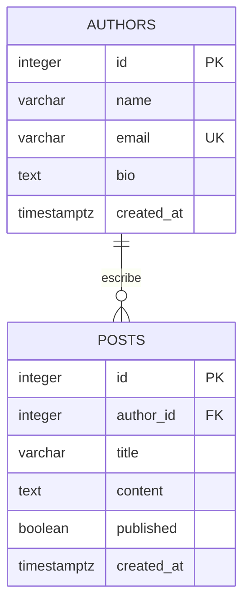

# Base de datos de MiniBlog

## Modelo



Un autor puede tener cero o muchos posts. Cada post debe pertenecer a un autor existente. `author_id` almacena la relación: no duplicamos el nombre y el email del autor en cada post.

## Reglas

| Campo o relación | Regla |
|---|---|
| `authors.id`, `posts.id` | Clave primaria con IDs generados por SERIAL |
| `authors.name` | Obligatorio, máximo 100 caracteres y al menos un carácter no blanco |
| `authors.email` | Obligatorio, único, máximo 150 caracteres y formato básico de correo |
| Normalización del email | Guardado sin espacios exteriores y en minúsculas; la futura API lo normalizará antes de persistir |
| `authors.bio` | Opcional, puede ser NULL |
| `posts.author_id` | Obligatorio y debe referenciar un autor existente |
| `posts.title` | Obligatorio, máximo 200 caracteres y no vacío |
| `posts.content` | Texto obligatorio y no vacío |
| `posts.published` | Booleano obligatorio; por defecto FALSE |
| `created_at` | TIMESTAMPTZ obligatorio con fecha de creación automática |
| Eliminar autor | ON DELETE CASCADE elimina también sus posts |

La base impide almacenar datos inválidos aunque una consulta no pase por la API. La API agregará validación de tipos y mensajes HTTP comprensibles en su etapa de implementación.

PostgreSQL crea índices para PRIMARY KEY y UNIQUE. Agregamos `posts_author_id_idx` para consultar posts de un autor y facilitar el borrado relacionado. No agregamos índices redundantes sobre los IDs o el email.

## Preparación local desde cero

Requiere PostgreSQL funcionando y una cuenta administradora local. En macOS con Homebrew, la cuenta que inicializó PostgreSQL suele tener ese rol. Estos comandos de creación son para una instalación nueva: no es necesario repetirlos si el rol y las bases ya existen.

```bash
createuser --login --pwprompt --no-superuser --no-createdb --no-createrole miniblog_user
createdb --owner=miniblog_user miniblog
createdb --owner=miniblog_user miniblog_test
```

El comando `createuser` solicita una contraseña sin colocarla en el historial de comandos. No se debe usar `sudo` para ejecutar estas herramientas de PostgreSQL.

Copia `.env.example` a `.env` solo si aún no tienes configuración local. Sustituye `CHANGE_ME` por tu contraseña en ambas URLs. Si la contraseña contiene caracteres reservados de una URL, codifícalos; una contraseña aleatoria larga alfanumérica evita esa ambigüedad. Conserva `.env` fuera de Git y limita sus permisos:

```bash
chmod 600 .env
```

Con la configuración lista, desde la raíz del proyecto:

```bash
npm run db:setup
npm run db:seed
npm run db:verify
```

`db:setup` crea tablas e índice dentro de la base indicada por DATABASE_URL. No crea el servidor ni la base de datos. `db:seed` inserta tres autores y cinco posts ficticios. `db:verify` usa exclusivamente la base local `miniblog_test`, con TEST_DATABASE_URL.

El setup puede repetirse sin borrar tablas; **no es un sistema de migraciones**: si una tabla existente necesita cambios, deben realizarse mediante un script ALTER explícito. El seed puede repetirse secuencialmente sin duplicar los ejemplos ni sobrescribir sus modificaciones. Ninguno se ejecuta automáticamente al arrancar el servidor.

## Autenticación de desarrollo

En el entorno de desarrollo de este proyecto se configuró `miniblog_user` sin privilegios de superusuario, creación de bases o creación de roles. Las bases `miniblog` y `miniblog_test` pertenecen a ese rol. Se retiró el permiso de conexión y creación de temporales al grupo PUBLIC en esas dos bases:

```sql
REVOKE CONNECT, TEMPORARY ON DATABASE miniblog FROM PUBLIC;
REVOKE CONNECT, TEMPORARY ON DATABASE miniblog_test FROM PUBLIC;
```

Para requerir la contraseña del usuario del proyecto en una instalación local que originalmente utiliza trust, un administrador puede agregar estas reglas **antes de las reglas generales** en el `pg_hba.conf` activo:

```text
local miniblog,miniblog_test miniblog_user scram-sha-256
host miniblog,miniblog_test miniblog_user 127.0.0.1/32 scram-sha-256
host miniblog,miniblog_test miniblog_user ::1/128 scram-sha-256
```

El administrador puede localizar el archivo con `SHOW hba_file;`, comprobar sus reglas con `SELECT line_number, error FROM pg_hba_file_rules WHERE error IS NOT NULL;` y recargarlo con `SELECT pg_reload_conf();`. No copiar credenciales al SQL ni a este archivo de reglas.

Estas reglas son específicas del usuario y las bases de MiniBlog. No modifican la administración del resto del servidor local ni constituyen una configuración completa de producción. PostgreSQL sigue escuchando en localhost. La autenticación de Railway se configurará con las variables proporcionadas por ese servicio.

## Consultas para explorar los datos

Abre una sesión con el usuario de la aplicación; `-W` solicita su contraseña de forma interactiva:

```bash
psql -h 127.0.0.1 -U miniblog_user -d miniblog -W
```

Después puedes ejecutar:

```sql
SELECT id, name, email FROM authors ORDER BY id;

SELECT posts.id, posts.title, posts.published, authors.name AS author_name
FROM posts
INNER JOIN authors ON authors.id = posts.author_id
ORDER BY posts.id;
```

Para salir de psql, utiliza `\q`. Los IDs pueden tener saltos: una secuencia no garantiza números consecutivos y sus incrementos no se revierten con ROLLBACK. Por eso el seed obtiene las relaciones mediante el email y las pruebas usan los IDs devueltos por RETURNING.

## Comprobaciones automatizadas de SQL

`npm run db:verify` comprueba:

- Repetición de setup y seed sin duplicar registros.
- INSERT, SELECT, UPDATE y DELETE sobre ambas tablas.
- JOIN entre posts y authors.
- Fechas y valor published:false por defecto.
- Email duplicado, campos nulos o blancos y formato/normalización del email.
- Rechazo de autor inexistente, título demasiado largo y booleano inválido.
- Diferencia entre borrar un registro existente e inexistente.
- Eliminación de posts en cascada al borrar su autor.

El script solo acepta una conexión local a la base `miniblog_test`, diferente de la base de la aplicación. Aplica setup/seed ahí y envuelve los cambios de los casos CRUD en una transacción que revierte al terminar. No trunca tablas ni borra la base. Los incrementos de secuencias pueden permanecer.

Esta verificación real de SQL complementará los tests unitarios y HTTP de Vitest/Supertest; no los sustituye.

## Referencias

- [Restricciones de PostgreSQL 17](https://www.postgresql.org/docs/17/ddl-constraints.html).
- [Reglas de autenticación de PostgreSQL 17](https://www.postgresql.org/docs/17/auth-pg-hba-conf.html).
- [Consultas parametrizadas de node-postgres](https://node-postgres.com/features/queries).
